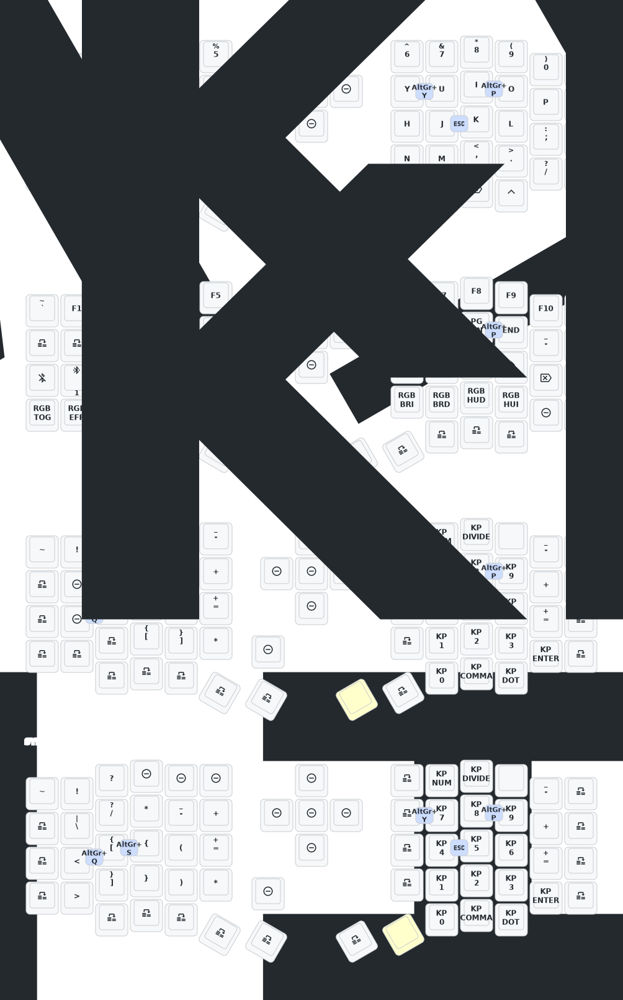

# Eyelash Sofle Vim Dev Keymap

US-International ZMK keymap for the **Eyelash Sofle Split Keyboard**, optimized for **Vim users and developers**, with German character support via RA() combos.

---

## Layers Overview

### Layer 0 – Base
Standard typing layer with US-Intl keys and RA() combos for German characters.

### Layer 1 – Navigation + Extras
Thumb-held layer with arrow keys, Home/End, Page Up/Down, and function keys.

### Layer 2 – Symbols & Numbers
Coding-focused layer with symbols, brackets, and a numpad-style layout.

---

## Combos

| Combo | Keys | Output |
|------|------|--------|
| `JK` | J + K | ESC (Vim Normal Mode) |
| `AE` | A + S | ä |
| `OE` | O + P | ö |
| `UE` | U + I | ü |
| `SS` | S + D | ß |

> Combos can be adjusted in `behaviors.dtsi` and `keymap.dtsi`.

---

## Firmware Build & Download

### GitHub Actions Workflow

This repository includes a GitHub Actions workflow based on the upstream  
[`zmkfirmware/zmk`](https://github.com/zmkfirmware/zmk) project.

The workflow automatically builds the firmware and uploads it as an artifact.

**Triggers:**
- `push`
- `pull_request`
- manual trigger via `workflow_dispatch`

To trigger it manually:
1. Go to the **Actions** tab in your forked repository
2. Select the workflow
3. Click **Run workflow**

---

### Workflow Artifacts

After a successful build, download the artifact from the **Actions** tab.

The extracted `.zip` file contains:

- `sofle_left-nice_nano_v2-zmk.uf2`
- `sofle_right-nice_nano_v2-zmk.uf2`
- `settings_reset-nice_nano_v2-zmk.uf2`

---

### Prebuilt Firmware (Releases)

Prebuilt firmware files may also be available under **Releases**.

> ⚠️ **Important**
>
> Release builds are provided **only for the Eyelash Sofle with nice!nano v2**.
>  
> If you are using a different controller or hardware variant, please build the
> firmware yourself using the GitHub Actions workflow.

---

## Flashing the Firmware

1. Connect one half of the keyboard to your computer using a USB-C cable.
2. Press the **BOOT** button **twice quickly** to enter bootloader mode.
3. The keyboard will appear as a USB mass storage device.
4. Drag and drop the correct `.uf2` file onto the drive:
   - Left half → `sofle_left-nice_nano_v2-zmk.uf2`
   - Right half → `sofle_right-nice_nano_v2-zmk.uf2`
5. The keyboard will reboot automatically and flash the firmware.

Repeat the process for the other half.

---

## Installation Summary

1. Fork or clone this repository
2. Build the firmware via GitHub Actions **or** download it from Releases
3. Flash the firmware to both halves of your Eyelash Sofle
4. Enjoy a Vim-optimized layout with German character support 🚀

---

## License

MIT License – feel free to fork, modify, and adapt this keymap for your own setup.
